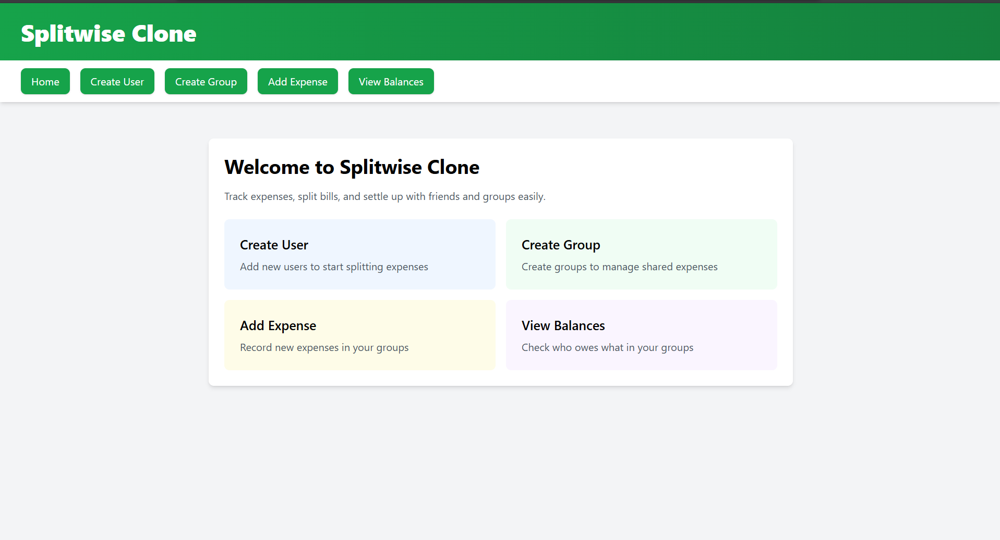
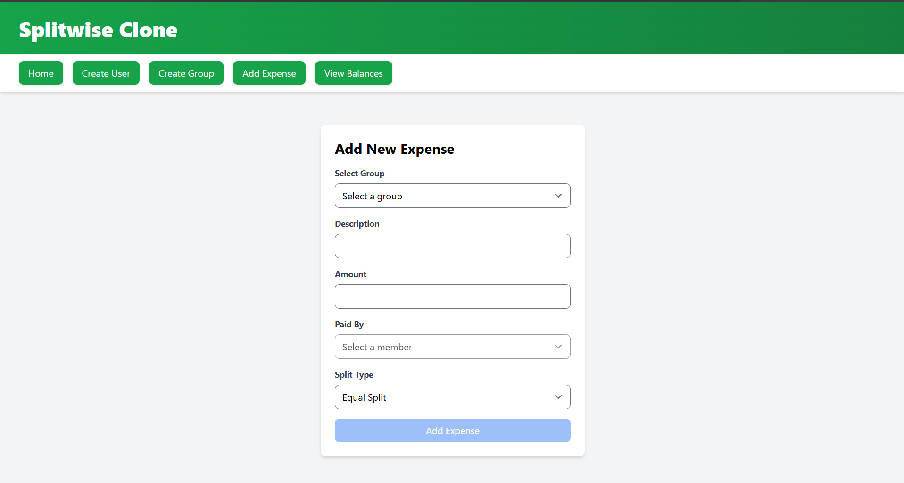

# Splitwise Clone – Neurix Full-Stack SDE Assignment

A full-stack application to track shared expenses, split costs (equally or by percentage), and view balances within groups. Built with **FastAPI** (Python), **PostgreSQL**, **React**, and **TailwindCSS**.

---

## Screenshots





---

## Features
- **Group Management:** Create groups and add users
- **Expense Management:** Add expenses, split equally or by percentage
- **Balance Tracking:** View who owes whom in a group and personal balances
- **Modern UI:** Clean, responsive interface with TailwindCSS
- **API-first:** RESTful backend with OpenAPI docs

---

## Tech Stack
- **Backend:** FastAPI, SQLAlchemy, PostgreSQL
- **Frontend:** React, TailwindCSS

---

## Getting Started

### Prerequisites
- [Python 3.9+](https://www.python.org/downloads/)
- [Node.js & npm](https://nodejs.org/)
- (Optional) [Git](https://git-scm.com/)

### Backend (FastAPI)

1. **Install dependencies:**
   ```sh
   cd backend
   pip install -r requirements.txt
   ```
2. **Start the backend server:**
   ```sh
   uvicorn app.main:app --reload
   ```

### Frontend (React)

1. **Install dependencies:**
   ```sh
   cd frontend
   npm install
   ```
2. **Start the frontend app:**
   ```sh
   npm start
   ```

3. **Access the app:**
   - Frontend: [http://localhost:3000](http://localhost:3000)
   - Backend API: [http://localhost:8000/docs](http://localhost:8000/docs) (OpenAPI docs)

---

## API Documentation

### Group Management
- `POST /groups` – Create a new group
  - Body: `{ name: string, user_ids: [int] }`
- `GET /groups/{group_id}` – Get group details

### Expense Management
- `POST /groups/{group_id}/expenses` – Add expense
  - Body: `{ description, amount, paid_by, split_type, splits }`
- `GET /groups/{group_id}/expenses` – List expenses in group

### Balance Tracking
- `GET /groups/{group_id}/balances` – Group balances (who owes whom)
- `GET /users/{user_id}/balances` – User’s balances across groups

> For full details and schemas, see [http://localhost:8000/docs](http://localhost:8000/docs)

---

## Project Structure
```
assignment/
├── backend/      # FastAPI app
├── frontend/     # React app
└── README.md
```

---

## Assumptions
- No authentication/authorization required
- No payment/settlement functionality
- All users in a group are assumed to exist before group creation
- Only equal and percentage splits are supported

---

## License
This project is for educational/demo purposes only.
